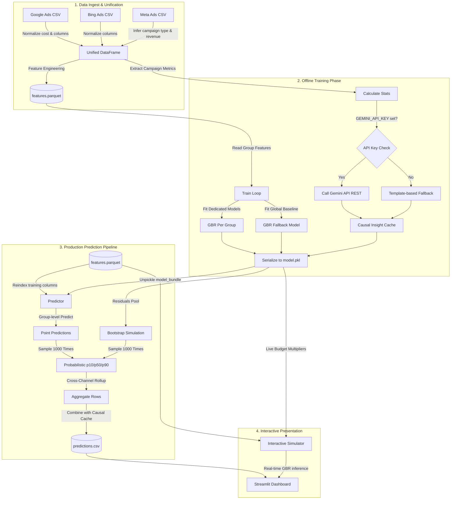

# System Architecture

The following diagram illustrates the flow of data during both the **Training Phase** (one-time, offline, network calls allowed) and the **Prediction Phase** (production pipeline, self-contained, no network calls).

## Workflow Execution Summary
1. **Unification:** `load_and_unify_all` maps varying columns into a unified scheme (date, channel, campaign_type, spend, revenue, clicks, impressions, conversions, daily_budget).
2. **Features:** `generate_features.py` builds time variables, rolling window values, and holiday flags.
3. **Training:** `train.py` runs once, fits $N$ models, runs API calls to build caches, and saves everything to `model.pkl`.
4. **Prediction:** `predict.py` executes without internet. It uses bootstrap residuals to add probabilistic range bounds.
5. **App:** `streamlit_demo.py` loads the cached model and outputs, permitting users to toggle budget sliders to dynamically see forecasted shifts.
